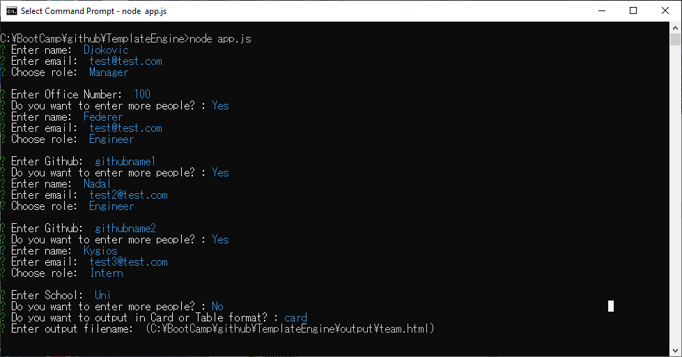

# Template Engine 

## Description 
This is a command line application which generates a software engineering team table in html. The application will prompt the user for information about the team manager and then information about the team members. The user can input any number of team members, and they may be a mix of engineers and interns. When the user has completed building the team, the application will create an HTML file that displays a nicely formatted team roster based on the information provided by the user. 


## Installation 
#### Prerequisite
Ensure [Node.js](https://nodejs.org) is installed as this application is developed using node.js. 

#### Install libraries 

```
$ npm install 
```

## Usage 
1.Run application  
```
$ node app.js 
```
2. Follow the screen messages and enter names of team members. 
3. Choose output format (card or table).
4. Enter output filename.




Once application is completed, HTML file is generated in `./output/team.html`. 

If you have changed the default output filename, html file is output in the specified directory. 

#### Sample output by Card


#### Sample output by Table


## Testing 

This application was built by practicing the TDD (Test Driven Development). 
The test can be run by the following command. 

```
$ npm test run
```

Also, use the following command, if you want to test the html output without using the command line 'inquire'.

```
$ node appTest.js
```

The test tool is built using [Jest](https://jestjs.io/).

## Technologies

[Node.js](https://nodejs.org), [Inquirer.js](https://www.npmjs.com/package/inquirer), [EJS](https://www.npmjs.com/package/ejs), [Bootstrap](https://getbootstrap.com/), [Jest](https://jestjs.io/)


Using the EJS allowed me to write control statement within the html template files. All I need to do is to pass the array of data objects to  html template file. Thanks to this library, I was able to make the application to provide choice of two layout of html easily.


## Credit 
Web icons provided by [Fontawesome](https://fontawesome.com/).
