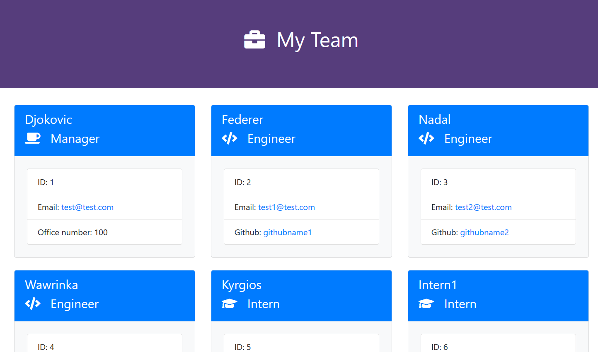

# TemplateEngine

## Description 
This is a software engineering team generator command line application. The application will prompt the user for information about the team manager and then information about the team members. The user can input any number of team members, and they may be a mix of engineers and interns. When the user has completed building the team, the application will create an HTML file that displays a nicely formatted team roster based on the information provided by the user. 

## Usage

1. Install libraries 
$ npm install 

2. Run application  
$ node app.js 

3. HTML file is generated once application is completed. 
Open it in your web browser.

## Testing 

This application was built by practicing the TDD (Test Driven Development). 
The test can be run by the following command. 

$ npm test run

Also, use the following command, if you want to test the html output without using the command line inquire.

$ node appTest.js

## Credit 
Inquirer.js https://www.npmjs.com/package/inquirer

EJS https://www.npmjs.com/package/ejs

Bootstrap https://getbootstrap.com/

Font awesome 

## Screen Capture

